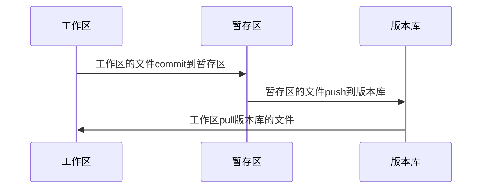

## 🙋 问题

1. 不懂Git是啥原理

## 💡 方法

- Git库的概念

``` mermaid
sequenceDiagram
    工作区 ->> 暂存区: 工作区的文件commit到暂存区
    暂存区 ->> 版本库: 暂存区的文件push到版本库
    版本库 ->> 工作区: 工作区pull版本库的文件
```

## 📝 总结

🎈🎈 Git管理项目天下第一  🎉🎉🎉

## 🔍 参考

- 无